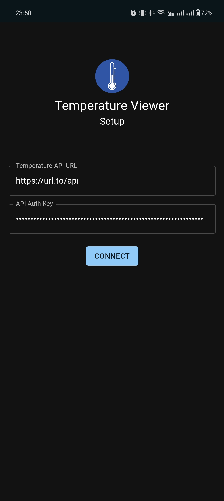
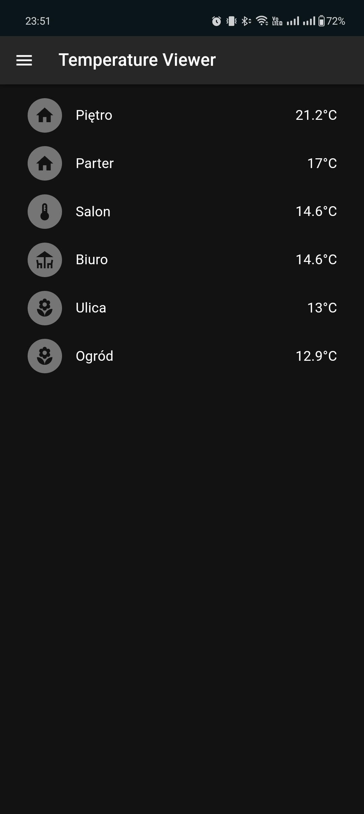
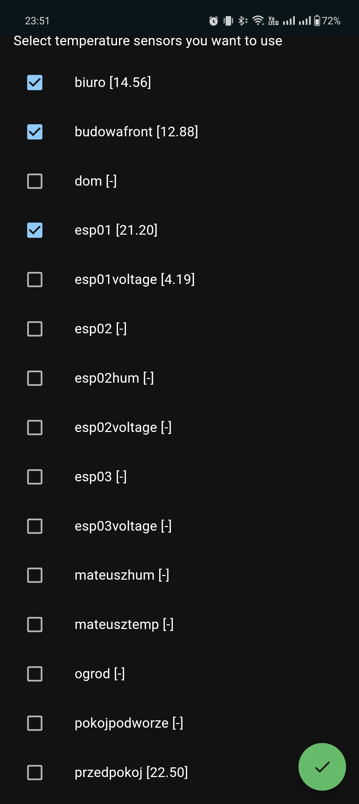
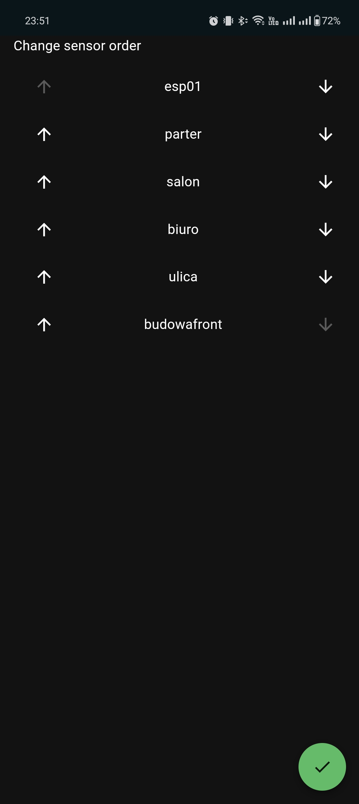
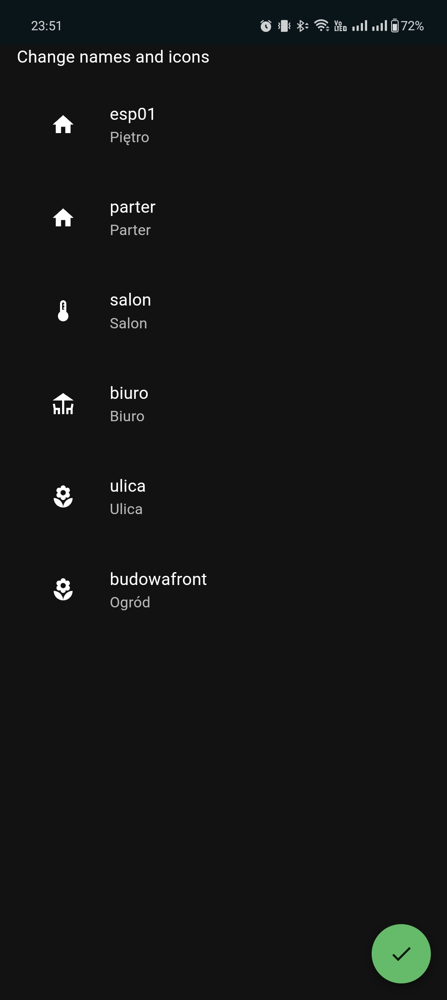

  
  <h1 align="center">Temperature Viewer</h1>

Monitor your home temperatures

Web app made with React/Vite

*It's still work-in-progress*

#### Backend:

https://github.com/najdek/temp_api

## Screenshots:

  
  

  
  

  

